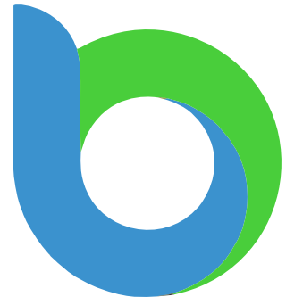

# Beau Bremer's Professional Portfolio & Technical Playground

## 👋 Hey there!
Welcome to the source code for [beaubremer.com](https://beaubremer.com/). This is my digital home—a living project where I showcase my background in **Technical Project Management** and **AV/IT Systems**, while experimenting with the modern web.

I believe in a straightforward, hands-on approach to tech. This site is a testament to that: built from scratch, refined through curiosity, and maintained with a focus on clean code and solid security.

## Engineering Standards (The "Under the Hood" Stuff)
I like my projects to run as smoothly as the systems I manage. To keep things high-performance and secure, I've implemented:
*   **Static Analysis & Quality:** I use **ESLint** with security-focused plugins to catch bugs and vulnerabilities before they ever reach the site.
*   **Security-First Architecture:** A hardened Content Security Policy (CSP) with zero `'unsafe-inline'` scripts. It’s built to be resilient.
*   **Privacy & Performance:** I’ve moved to **Self-Hosted Typography** to keep things private and fast, resolving fingerprinting blocks while keeping the sub-second Tailwind build times.
*   **Automated Auditing:** Continuous dependency scanning via **Snyk** keeps the supply chain clean.

## Cool Things I've Built Here
*   **AI Weather Bot:** A serverless Node.js app that pairs Google Gemini with OpenWeatherMap for conversational updates.
*   **Dynamic UX:** The homepage greeting changes in real-time based on the weather in Chicago—just a little touch to make the site feel alive.
*   **Privacy-First Resume Workflow:** An interactive request system that protects personal info from scrapers while ensuring you get the latest version.
*   **Network Diagnostics:** A suite of lightweight utilities for AV/IT pros, including a Latency Monitor and IP Subnet Calculator.

## The Stack
*   **Frontend:** HTML5, CSS3, ES6+ JavaScript, Tailwind CSS, Chart.js.
*   **Backend:** Netlify Functions (Node.js), Firebase Firestore.
*   **Services:** Cloudflare WAF/DNS, Google Gemini AI, Resend.

## Documentation & Labs
If you're curious about the "why" behind the "what," check out:
*   **[Full Design Rationale](docs/DESIGN_NOTES.md)**: My thoughts on color, typography, and professional branding.
*   **[Security Log](securitylog.md)**: A transparent record of every security hardening action I've taken.
*   **[The Labs (Experimental)](https://beaubremer.com/labs.html)**: Where I keep my creative coding and data viz experiments.
*   **[Tor Onion Service](https://github.com/KnowOneActual/BB_Website/tree/onion-version)**: A privacy-focused, minimalist mirror of the site for the Tor network.

---

### Stay Bold. Keep Creating.
*   **LinkedIn:** [beau-bremer-chicago](https://www.linkedin.com/in/beau-bremer-chicago/)
*   **Blog:** [blog.beaubremer.com](https://blog.beaubremer.com/)
